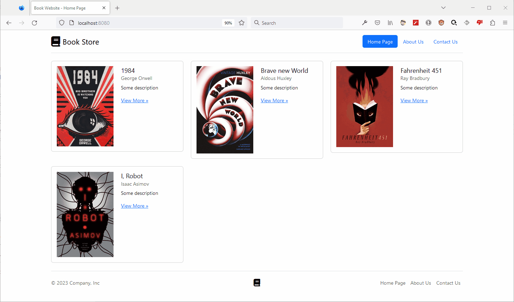

# MVC Introduction

ეს პროექტი არის დინამიური ვებ აპლიკაციის მაგალითი. აქ ჩვენ ვნახავთ თუ როგორ შეგვიძლია კონტროლერებისა
და [Thymeleaf](https://thymeleaf.org) ძრავის გამოყენებით ავაწყოთ დასაბრუნებელი HTML გვერდები დინამიურად.

აქვე განვიხილავთ Thymeleaf-ის ფრაგმენტებს და ლეიაუთს. გვაქვს ასევე ფორმის მარტივი მაგალითი, რომელსაც გავაუმჯობესებთ
შემდეგ მაგალითებში.

